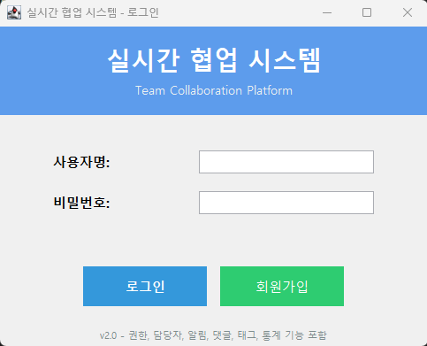
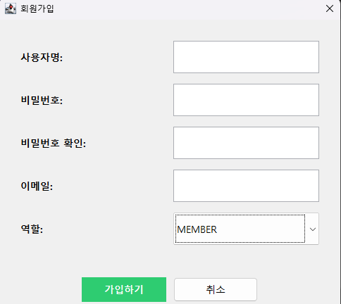
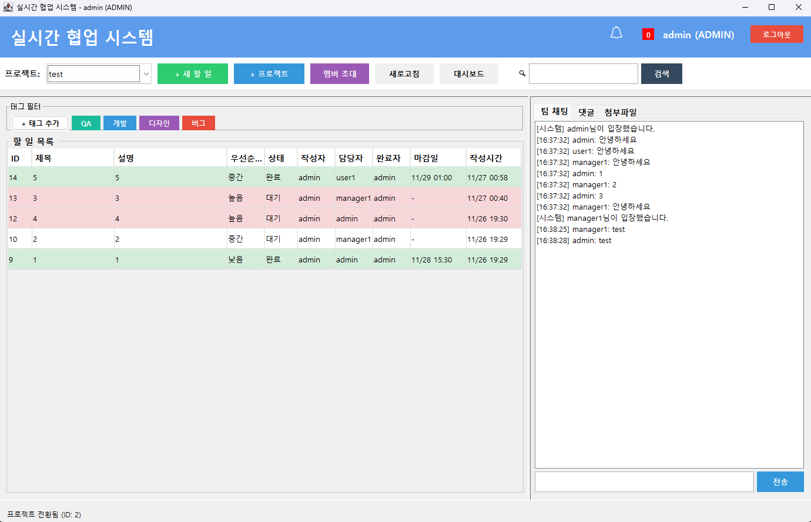
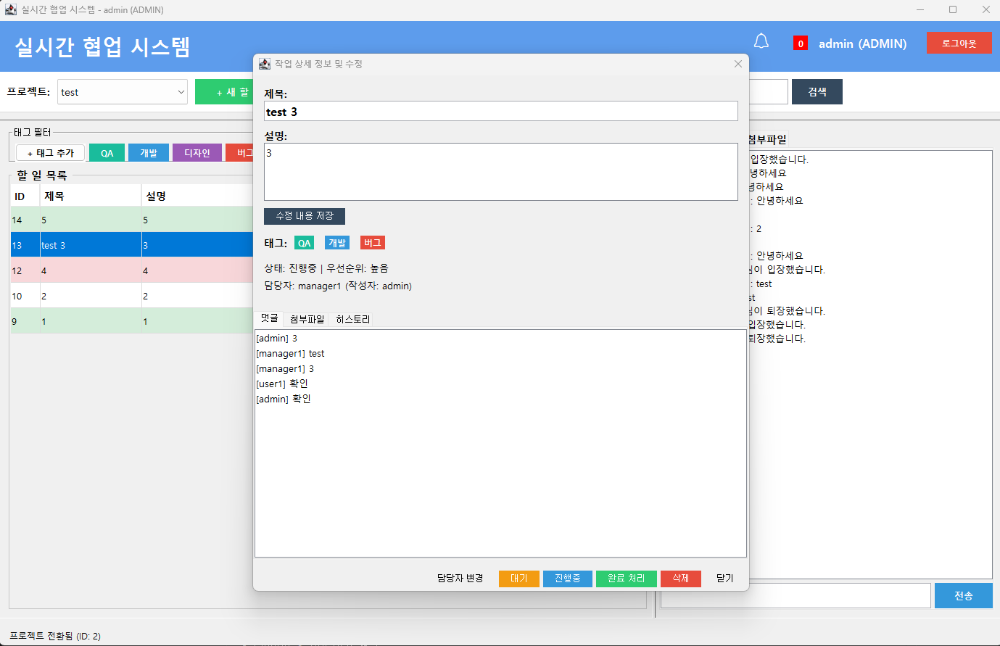
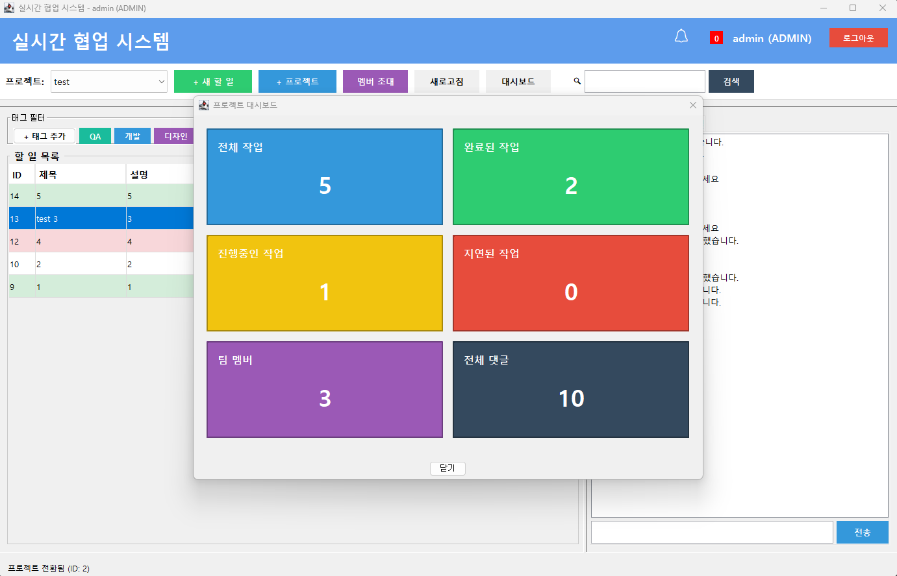
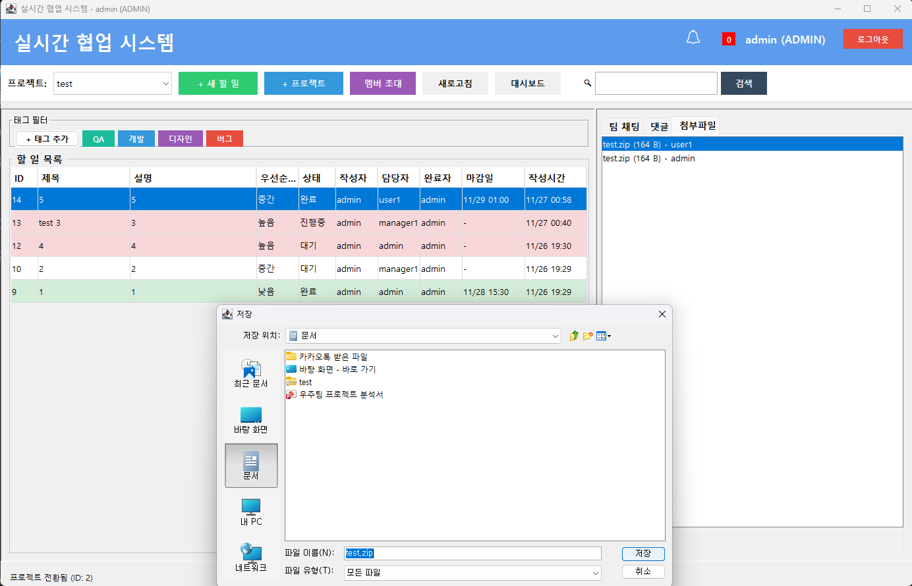

# 🚀 Java Real-time Collaboration Tool (SyncTeam)

**Java Socket 통신과 MySQL을 활용하여 개발한 실시간 팀 협업 플랫폼입니다.** 프로젝트 관리, 실시간 채팅, 파일 공유, 태그 기반 업무 관리 등 협업에 필요한 핵심 기능을 하나의 데스크톱 애플리케이션으로 구현했습니다.

---

## 🛠 Tech Stack (기술 스택)
- **Language**: Java (JDK 17+)
- **GUI**: Java Swing (Custom UI)
- **Network**: Java Socket Programming (TCP/IP, Multi-threading)
- **Database**: MySQL 8.0 (JDBC)
- **Tool**: VS Code, Git

---

## ✨ Key Features (핵심 기능)

### 1. 🔐 사용자 및 프로젝트 관리
- **회원가입/로그인**: SHA-256 암호화 및 Salt 적용으로 보안 강화.
- **프로젝트 관리**: 여러 개의 프로젝트를 생성하고 전환할 수 있습니다.
- **멤버 초대**: 아이디를 통해 팀원을 프로젝트에 초대하여 협업할 수 있습니다.

### 2. 📝 스마트한 할 일(Task) 관리
- **상태 관리**: 대기 / 진행중 / 완료 상태를 직관적인 버튼으로 변경.
- **태그 시스템**: `개발`, `디자인`, `버그` 등 태그를 생성하고 색상을 지정하여 필터링 가능.
- **실시간 수정**: 작업 제목, 설명을 수정하면 팀원들의 화면에도 즉시 반영 (Socket Broadcasting).

### 3. 💬 실시간 커뮤니케이션 & 파일 공유
- **팀 채팅**: 프로젝트 멤버들과 실시간으로 대화할 수 있습니다.
- **댓글 시스템**: 각 업무별로 댓글을 달아 피드백을 주고받을 수 있습니다.
- **파일 전송**: 이미지 및 문서를 서버로 업로드하고 다운로드할 수 있습니다 (Base64 Encoding).

### 4. 📊 데이터 시각화 (Dashboard)
- **실시간 대시보드**: 전체 작업 수, 진행률, 지연된 작업 등을 한눈에 파악할 수 있습니다.
- **Observer 패턴 응용**: 데이터 변경 시 대시보드 수치가 실시간으로 자동 갱신됩니다.

---

## 📸 Screenshots (실행 화면)

### 1. 로그인 화면 (Login)
깔끔한 파스텔 블루 톤의 UI 디자인을 적용했습니다. 사용자 경험(UX)을 고려하여 직관적인 레이아웃을 구성했습니다.

### 2. 회원가입 (Register)
새로운 사용자를 등록합니다. 비밀번호는 SHA-256 알고리즘과 Salt를 사용하여 안전하게 암호화되어 DB에 저장됩니다.

### 3. 메인 할 일 목록 (Task List)
선택한 프로젝트의 할 일 목록을 한눈에 볼 수 있습니다. 우선순위, 마감일, 상태별로 정렬되며 태그를 통해 직관적인 구분이 가능합니다.

### 4. 작업 상세 및 수정 (Task Detail)
작업의 세부 내용을 확인하고 수정할 수 있습니다. 댓글 작성, 파일 첨부, 히스토리 조회가 가능하며 담당자와 상태를 즉시 변경할 수 있습니다.

### 5. 실시간 대시보드 (Dashboard)
프로젝트의 진행 상황을 실시간 통계로 시각화했습니다. 전체 작업 수, 진행률, 지연된 작업 등을 한눈에 파악할 수 있습니다.

### 6. 팀 채팅 & 파일 공유 (Chat & File Share)
프로젝트 멤버들과 실시간으로 소통하며 파일을 주고받을 수 있습니다. 업로드된 파일은 서버에 저장되며 언제든 다시 다운로드할 수 있습니다.

---

## 💾 Database Schema (ERD)
이 프로젝트는 `Users`, `Projects`, `Tasks`, `Attachments`, `Comments` 등 정규화된 관계형 데이터베이스 설계를 따릅니다.
*(database 폴더 내의 SQL 파일을 참고하세요)*

---

## 🚀 How to Run (실행 방법)

1. **데이터베이스 설정**
   - `database` 폴더의 SQL 파일들을 MySQL에 import 합니다.
   - `db.properties.example` 파일명을 `db.properties`로 변경하고, 본인의 DB 아이디/비번을 입력합니다.

2. **서버 실행**
   - `CollaborationServer.java`를 실행하여 서버를 켭니다 (Port: 8888).

3. **클라이언트 실행**
   - `LoginWindow.java`를 실행하여 접속합니다.

---

## 👨‍💻 Developer
- **Name**: 루쿠
- **Role**: Backend & Client Developer
- **Contact**: jdw2318@gmail.com